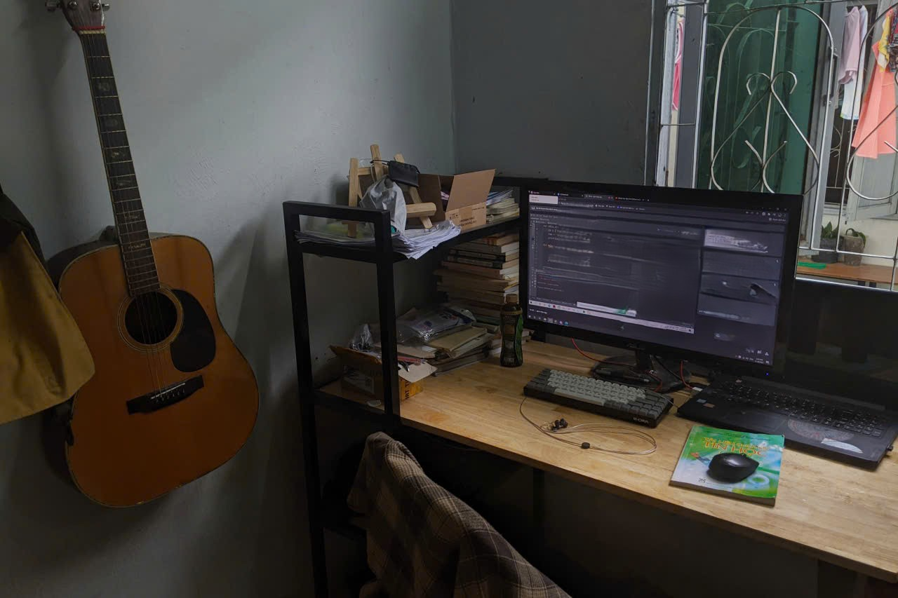
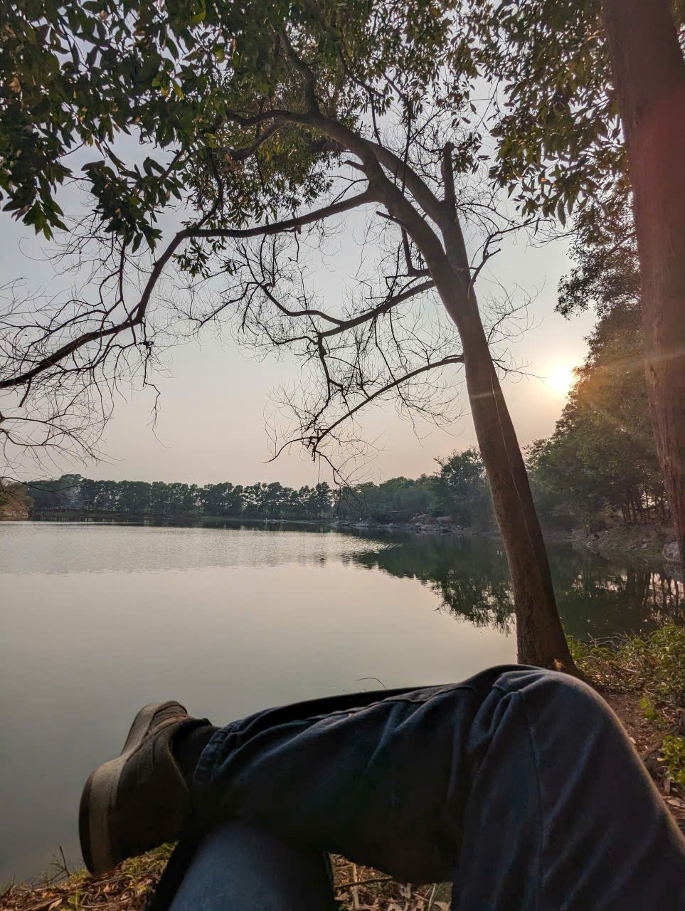
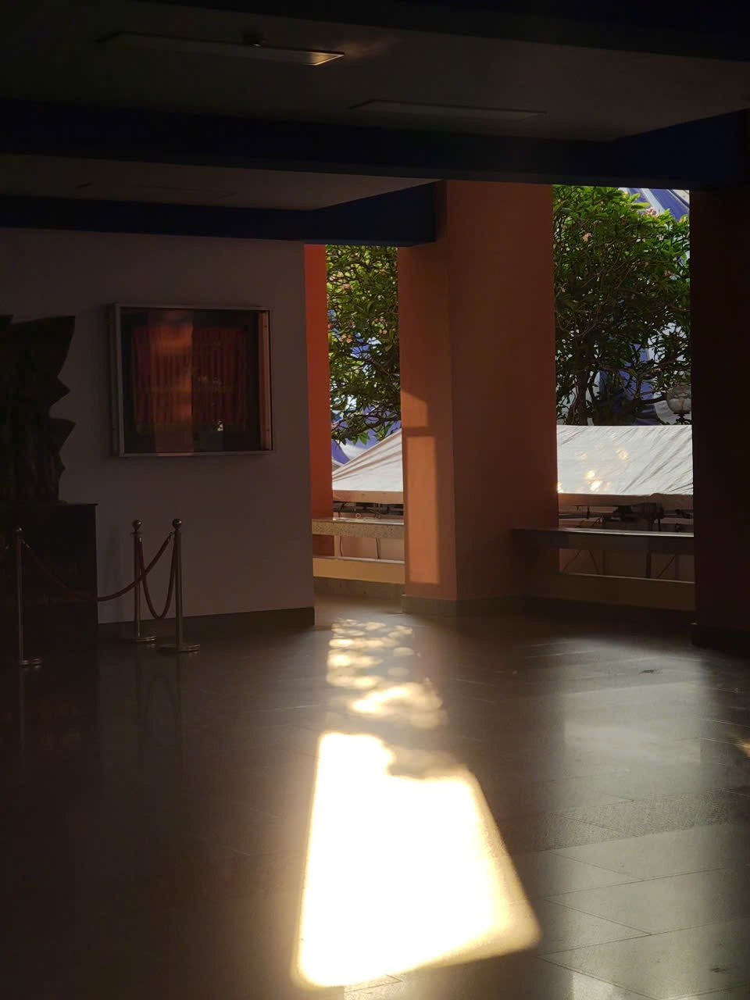

# Hi, I'm Duy! 👋

### Aspiring AI Engineer & Researcher

**I turn papers into experiments, experiments into evidence, and occasionally evidence into useful apps.**

`Multimedia Retrieval` · `Multimedia Verification` · `Computer Vision` · `Research Tooling`

Currently retrieving events, verifying media, and making research a little less chaotic.

  
   
  Where papers, prototypes, and guitar breaks happen.

## 📚 Publications

- **[Ægis: AI-Enhanced OSINT for Multimedia Verification](https://dl.acm.org/doi/10.1145/3746027.3762034)** — ACM Multimedia 2025 
  Minh-Anh Pham, Anh-Tai Pham-Nguyen, **Anh-Duy Le**, et al. · An AI-enhanced OSINT system for multimedia verification, forensic analysis, and evidence validation.
- **[MERVIN: A Unified Framework for Multimodal Event Retrieval in Vietnamese News Videos](https://arxiv.org/abs/2605.16120)** — SOICT 2025 
  Anh-Tai Pham-Nguyen, Tung-Duong Le-Duc, **Anh-Duy Le**, Trung-Hieu Truong-Le · A multimodal retrieval framework combining keyframes, transcripts, and video summaries.

## 🔬 What I'm working on

- 🔎 **Multimedia retrieval and verification**: building systems that search across visual and textual evidence and help verify real-world media.
- ⚡ **Efficient LLM inference — in progress**: currently experimenting with serving Qwen3.5-2B using vLLM for the Viettel AI Race 2026.
- 🧭 **Research Navigator**: a local-first tool that connects research goals, questions, experiments, decisions, and evidence.

## 🧪 Selected projects

| Project | What it does |
| --- | --- |
| [Research Navigator](https://github.com/Le-Anh-Duy/Research-Tracker) | A local-first research planning system with evidence tracking, experiment history, a CLI, and MCP support for coding agents. |
| [vLLM Colab Inference](https://github.com/Le-Anh-Duy/vLLM-Colab-Inference) | An inference optimization workspace for benchmarking TTFT/TPOT, evaluating GPQA accuracy, and shipping a reproducible vLLM setup. |
| [NutriScan](https://github.com/Le-Anh-Duy/ML-Final-NutriScan) | A computer vision app that recognizes Vietnamese food with LSNet and turns predictions into nutrition-aware meal suggestions. |
| [Speaking Practice App](https://github.com/Le-Anh-Duy/elsa-clone) | An AI pronunciation coach using Whisper, text-to-speech, IPA conversion, and similarity scoring. |
| [Bus Routing Application](https://github.com/Le-Anh-Duy/Bus-routing-application) | A Python bus management and route-search system with geospatial processing and LLM-assisted search. |
| [TensorTonic Solutions](https://github.com/Le-Anh-Duy/TensorTonic-Solutions) | My Python solutions and notes for hands-on tensor and machine learning problems. |

## 🎮 Side quests

- [Vintage TODO](https://github.com/Le-Anh-Duy/vintage-todo) — a full-stack task manager dressed like a green CRT terminal, because normal todo apps were not dramatic enough.
- [Quiz App](https://my-quiz-app-vibing.vercel.app) — a small Next.js quiz playground you can try live.
- [Life Management App](https://life-management-425v.onrender.com/) — the app I built after deciding one todo list was clearly not enough.
- [Valentine 22](https://le-anh-duy.github.io/valentine22/) — proof that CSS can also be a love language. 💌

## 📷 Through my lens

Research taught me to notice small details. Photography does too.

| A quiet pause by the lake | Afternoon light at my university |
| :---: | :---: |
|  |  |

## 🧰 Tools I reach for

`Python` · `PyTorch` · `OpenCV` · `vLLM` · `React` · `TypeScript` · `Node.js` · `Git`

---

If you're also turning messy ideas into testable systems, we'll probably have something to talk about.

